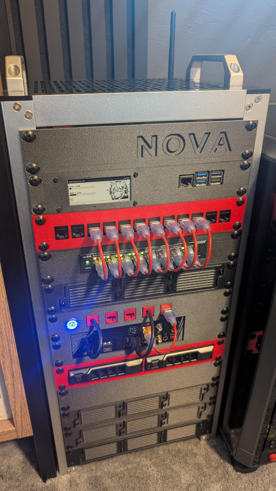

# nova-homelab

[](https://fedoraproject.org/server/)
[](https://podman.io/)
[](https://docs.ansible.com/)
[](https://docs.renovatebot.com/)

[](https://github.com/Zireaell1/nova-homelab/blob/main/LICENSE)
[](https://github.com/Zireaell1/nova-homelab/commits/main/)
[](https://github.com/Zireaell1/nova-homelab/actions)

<p align="center">
  
</p>

> [!WARNING]
> **Work in progress**
> This project is currently under heavy development. I decided to make the repository public early so I can continue building, troubleshooting, and documenting in the open. You might find a few placeholders in the docs or Ansible roles that are still being refined, but new updates are being pushed regularly!

Hi. This is the repository for my homelab server, Nova. It serves as a home for my Ansible scripts, but also provides documentation for everything related to the server, its installation, and the build process.

Of course, this is specifically tailored for my own use case, but feel free to use it and make changes! I think there is a lot of really useful knowledge here if you are building your own server.

Keep reading below if you want to know more about the hardware, the services I'm running, and the headaches I ran into along the way. :)

> [!NOTE]
> **AI Transparency Notice**
> I know this is a sensitive topic for developers right now. I started this project as a beginner to self-hosting, so I used AI as a tutor to learn, improve my code, and help troubleshoot bugs. That being said, I never blindly copy-pasted code. Everything generated was cross-referenced with official documentation and manually fixed whenever the AI decided to hallucinate some "AI slop." :)

## Deployed Services

Here is a complete list of the services currently managed by Ansible (primarily deployed as rootless Podman Quadlets, alongside a few native system agents).

### Dashboard
| Service | Description |
| :--- | :--- |
| **[Homepage](https://gethomepage.dev/)** | The visual command center mapping out all exposed services. |

### Security
| Service | Description |
| :--- | :--- |
| **[Caddy](https://caddyserver.com/)** | Reverse proxy handling routing and automatic SSL via Cloudflare. |
| **[Pi-hole](https://pi-hole.net/)** | Network-wide ad-blocking and local DNS resolution. |
| **[Authelia](https://www.authelia.com/)** | 2FA gatekeeper for exposed services. |
| **[Tailscale](https://tailscale.com/)** | Mesh VPN installed natively on the host for secure remote access without port forwarding. |

### Smart Home & CCTV
| Service | Description |
| :--- | :--- |
| **[Home Assistant](https://www.home-assistant.io/)** | The core automation hub (running as a native container without Supervisor). |
| **[Frigate](https://frigate.video/)** | AI-powered NVR using a built-in NPU. |
| **[Zigbee2MQTT](https://www.zigbee2mqtt.io/)** | Translates physical Zigbee network traffic into MQTT. |
| **[Mosquitto](https://mosquitto.org/)** | Local MQTT broker. |

### Observability
| Service | Description |
| :--- | :--- |
| **[Grafana](https://grafana.com/)** | Main visualization UI for all server metrics and logs. |
| **[Prometheus](https://prometheus.io/)** | Time-series database scraping and storing hardware/container metrics. |
| **[Loki](https://grafana.com/oss/loki/)** | Log aggregation system for storing system and container logs. |
| **[Grafana Alloy](https://grafana.com/oss/alloy-opentelemetry-collector/)** | Native host agent routing metrics and systemd journals into the stack. |

### Backups
| Service | Description |
| :--- | :--- |
| **[Restic REST Server](https://github.com/restic/rest-server/)** | Podman container acting as a fast, secure backup target for my other devices. |
| **Custom Cloud Backups** | Custom Ansible role deploying rootless `.sh` scripts to automatically back up server data to the cloud. |

### Utilities & Hardware
| Service | Description |
| :--- | :--- |
| **[Vaultwarden](https://github.com/dani-garcia/vaultwarden/)** | Self-hosted password manager (lightweight Bitwarden alternative). |
| **[NUT](https://networkupstools.org/)** | Network UPS Tools daemon running natively on the host to monitor the physical battery backup. |
| **[Peanut](https://github.com/Brandawg93/PeaNUT/)** | Web dashboard acting as a frontend UI for the native NUT service. |
| **[OpenRGB](https://openrgb.org/)** | Hardware lighting control, built locally via a custom Podman `Containerfile`. |

### Orion (Raspberry Pi)
| Service | Description |
| :--- | :--- |
| **[nova-eink-display](https://github.com/Zireaell1/nova-eink-display)** | E-ink dashboard showing the server's state, running as a rootless systemd user service. |
| **[Grafana Alloy](https://grafana.com/oss/alloy-opentelemetry-collector/)** | Same host agent as on Nova, pushing Orion's metrics and journal to Prometheus and Loki. |

## Quick Start
> [!WARNING]
> **Use as a reference first!**
> Remember that some of these Ansible roles are heavily tailored to my specific hardware and network setup. I do not guarantee they will work out-of-the-box on your machines. I highly suggest using this repo as a reference first, or reading the docs for a detailed explanation. However, if you know what you are doing, here is the quick guide.

**Prerequisites:**
* [uv](https://docs.astral.sh/uv/) on your control machine - it installs the pinned Ansible toolchain from `uv.lock`, so you do not need Ansible installed globally.
* SSH keys configured and copied to the target server(s).

**1. Clone the repository and install dependencies:**
```bash
git clone https://github.com/Zireaell1/nova-homelab.git
cd nova-homelab/ansible
make deps    # creates .venv from uv.lock and installs the Galaxy collections into .collections
```

**2. Configuration (Inventory, Variables & Secrets):**
Before running anything, you need to configure your environment.
* **Inventory:** Copy `examples/inventory.ini.example` to `ansible/inventory.ini` and update it with your servers' actual IP addresses and SSH usernames. The host names must be `nova` and `orion` - the playbooks target them by name.
* **Variables:** Review the files in `group_vars/all/` (`vars.yml`, `paths.yml`, `podman.yml`, `endpoints.yml`, `backup.yml`) and the per-machine facts in `host_vars/`, and change any personal variables.
* **Secrets:** Copy `examples/vault.yml.example` to `ansible/group_vars/all/vault.yml`. Fill in your specific passwords and API keys, then encrypt the file using:
  ```bash
  uv run ansible-vault encrypt group_vars/all/vault.yml
  ```
* **Vault password:** Write your vault password into `ansible/.vault_pass` (it is gitignored). `ansible.cfg` points at this file, so Ansible will not start without it.

**3. The Playbooks:**
The deployment is explicitly split to safely separate root-level host configurations from rootless container deployments across both of my physical machines (Nova and Orion).
* `playbooks/nova_system.yml` - Base system setup for the main server. Requires root access (`-K`).
* `playbooks/nova_services.yml` - Rootless Podman deployment for all of the main server's services.
* `playbooks/orion_system.yml` - Base system setup for the Raspberry Pi e-ink display. Requires root access (`-K`).
* `playbooks/orion_services.yml` - Rootless deployment for the e-ink display services.

**4. Execution:**
I strongly suggest looking inside these playbooks first. From the `ansible/` directory, the `Makefile` wraps them (and adds `-K` for the system playbooks automatically). Use `t=` to deploy only specific parts of the stack and `c=1` for a dry run:
```bash
# Example 1: Running a system-level playbook (prompts for the sudo password)
make nova_system

# Example 2: Deploying specific rootless services
make nova_services t=grafana,prometheus

# Example 3: Dry run
make nova_services t=grafana c=1
```
`make help` lists everything. The raw equivalent is `uv run ansible-playbook playbooks/nova_services.yml --tags grafana`.

## Repository Structure
Currently, the repository is split into these areas:
* **`ansible/`** - The actual playbooks, inventory, and roles.
* **`docs/`** - The documentation. This is where I explain the services, the problems I faced, and the different choices I made.
* **`examples/`** - Templates for the inventory and the vault.
* **`scripts/ci/`** - The repository's own structural checks, run by CI and locally with `make check`.

## Docs
If you want to see exactly how this was built, check out the docs:
1. [The Hardware & 3D Printing](docs/01-hardware-and-rack.md)
2. [OS & Installation](docs/02-os-and-installation.md)
3. [Ansible](docs/03-ansible.md)
4. [Podman](docs/04-podman.md)
5. [Services Intro](docs/05-services-intro.md)
6. [Security Services](docs/06-security-services.md)
7. [Smart Home and CCTV Services](docs/07-smart-home-cctv-services.md)
