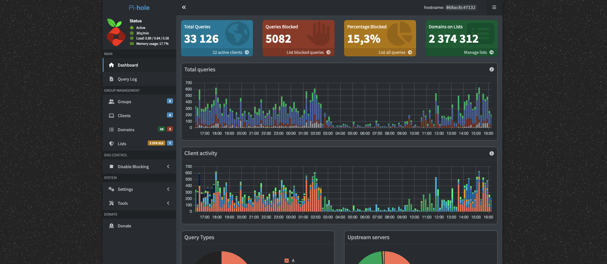
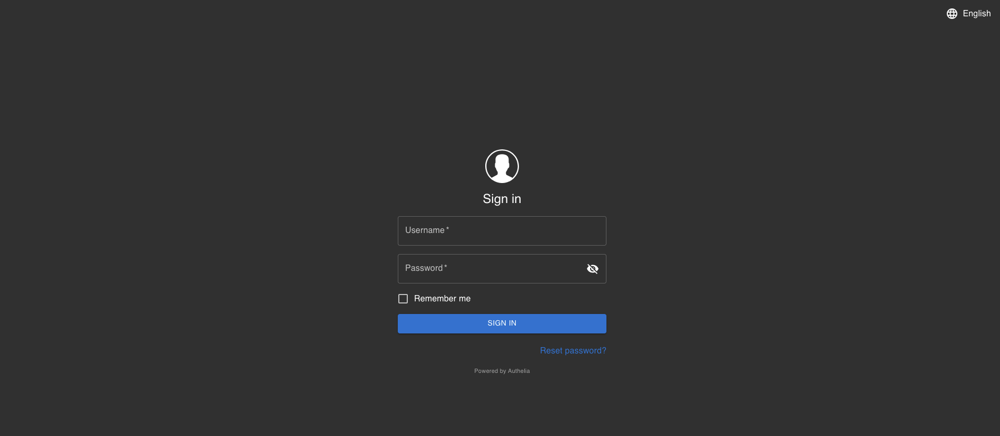

# Security Services

Let's start our services breakdown with the security stack. This includes Caddy, Pi-hole, and Authelia.

## Caddy

Caddy is the web server that acts as the reverse proxy—and essentially the front door—to all of our services.

The main advantage of using Caddy is how easily it allows us to build a system where services run in their own isolated Podman networks. We don't expose direct ports to the host machine. Instead, if you enter the domain name for Home Assistant into your browser, Caddy recognizes it, knows it lives on port `8123` in the internal Podman network, and securely proxies the connection.

Beyond just routing traffic, Caddy handles a few other critical jobs:
* **Authentication:** It passes incoming requests through Authelia to check if the user is allowed in.
* **Header Injection:** It can inject specific headers before passing the traffic to the backend service.
* **Automatic SSL:** It manages certificates automatically via the Cloudflare API. This ensures they are always renewed and valid, giving us fully working HTTPS encryption locally.
* **DNS Dependency:** Because Caddy relies on domain names rather than IP addresses to route traffic, it works hand-in-hand with Pi-hole (Pi-hole needs to define the local DNS entries first to make everything connect).

---

## Pi-hole

Pi-hole is our local DNS server (and currently acts as a DNS proxy). It intercepts all DNS requests from the network, runs them against its blocklists, and either drops the request or passes it upstream to a standard external DNS server.

This allows us to block a massive amount of ads, tracking scripts, and even malware at the network level. Of course, it is not perfect protection, but we treat security as a layered approach, and Pi-hole adds a tremendous amount of value to that stack. It is also just really nice to have a dashboard showing exactly what is happening on the network! :)

Pi-hole is also where we manage our Local DNS records, allowing us to easily define new subdomains for our services.

Currently, the blocklists are not managed via Ansible, so for future reference, these are the exact lists I use:
* `https://raw.githubusercontent.com/StevenBlack/hosts/master/hosts`
* `https://raw.githubusercontent.com/hagezi/dns-blocklists/main/adblock/pro.txt`
* `https://raw.githubusercontent.com/hagezi/dns-blocklists/main/adblock/tif.txt`
* `https://raw.githubusercontent.com/hagezi/dns-blocklists/main/adblock/dyndns.txt`
* `https://raw.githubusercontent.com/hagezi/dns-blocklists/main/adblock/hoster.txt`
* `https://raw.githubusercontent.com/hagezi/dns-blocklists/main/adblock/spam-tlds-adblock.txt`
* `https://raw.githubusercontent.com/hagezi/nrd/main/adblock/dga7.txt`

At the time of writing this document, that equals about **2.3 million blocked domains**. It's a lot, but the server handles it without breaking a sweat.

---

## Authelia

Authelia is our main authentication service. There are a few exceptions—like Home Assistant or Vaultwarden—that I do *not* put behind Authelia, simply because intercepting their traffic breaks their native mobile apps.

For the services that *are* behind Authelia, there are two ways authentication gets handled:

1. **Forward Auth (Header Injection):** This is the ideal scenario. When you log into Authelia, it verifies your permissions and adds specific headers (your username, email, etc.) to your traffic. If the backend service supports Forward Auth, it reads those headers, trusts them, and automatically logs you in, completely bypassing its own login screen.
2. **The "Double Login":** Not every service supports Forward Auth. In these cases, Authelia still acts as a gatekeeper in the front, but once it lets you through, the service itself ignores the Authelia headers and asks you to log in *again* to its own system. This adds two manual layers of auth. There isn't much we can do about that without heavily modifying the apps, so I just decided to accept it and keep it that way.

All the ACL (Access Control List) rules defining exactly which users can access which subdomains are located in the `configuration.yml` file inside the Authelia Ansible role.
